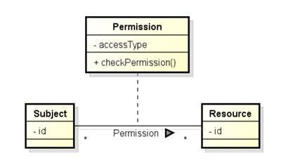

# Authorization pattern tutorial

## What is the _Authorization_ pattern?

This security pattern is used to implement an authentication mechanism. A class diagram of the pattern is given below.

PAMELA implementation of the pattern is build around three entities: _Subjects_, _Resources_ and _Permission Checkers_. _Subjects_ are the entities which want to access the _Resource_. _Resources_ need to be secured. Each of these have a _Permission Checker_ which can say whether an access to the _Resource_ is authorized based on the _Resource Identifier_ and the _Subject Identifier_ trying to access the resource. The authorization mechanism is thus the dynamic check to the of the _Permission Checker_ of a _Resource_ every time a _Subject_ tries to access it. 

## How to use the pattern?

### Subject and Resource entities

- Identify the _Subject_ class. This is the class whose instance will need to be authorized to access resources. This class should be annotated with `@ModelEntity` (to let the PAMELA framework know that it is part of your model) and `@AuthorizationSubject(patternID = <patternID>)` (to declare it as a _Subject_ for the Authorization pattern). The `<patternID` is a String identifying the pattern in you model. Note that the same `<patternID>` should be used for all annotations of the pattern. You could, for instance, have the following code:
~~~java
@ModelEntity
@AuthorizationSubject(patternID = "Authorization pattern 1")
public class mySubject {
    ...
}
~~~

- Identify the _Subject Identifier_ getter(s). They will be used to determine whether a _Subject_ instance is authorized to access a _Resource_ instance. Each of these getters should be annotated with `@SubjectID(patternID = <patternID>, paramID = <paramID>`). The <paramID> is a String identifying getter. You could, for instance, have the following code:
~~~java
@ModelEntity
@AuthorizationSubject(patternID = "Authorization pattern 1")
public class mySubject {
    
    @SubjectID(patternID = "Authorization pattern 1", paramID = "username")
    public String getUsername(){
        ...
    }

    @SubjectID(patternID = "Authorization pattern 1", paramID = "password")
    public int getPasswordHash(){
        ...
    }
}
~~~
- Similarly, identify the _Resource_ class and annotate it with `@ModelEntity` and `@ProtectedResource(patternID = <patternID>)`. The annotate its identifier getters with `@ResourceID(patternID = <patternID>, paramID = <paramID>)`. You could, for instance, have the following code:
~~~java
@ModelEntity
@ProtectedResource(patternID = "Authorization pattern 1")
public class ProtectedFile {
    
    @SubjectID(patternID = "Authorization pattern 1", paramID = "path")
    public String getPath(){
        ...
    }

}
~~~
- In the _Resource_ class, you should identify the _Permission Checker_ getter. This entity is the one which will check every access to the _Resource_. You could, for instance have the following code:
~~~java
@ModelEntity
@ProtectedResource(patternID = "Authorization pattern 1")
public class ProtectedFile {
    
    @SubjectID(patternID = "Authorization pattern 1", paramID = "path")
    public String getPath(){
        ...
    }

    @PermissionCheckerGetter(patternID = "Authorization pattern 1")
    public Permission getPermission(){
        ...
    }

}
~~~
- Identify the _Resource Access methods_. These methods are the one you want to protect. Each of this method should be annotated with `@AccessMethod(patternID = <patternID>, methodID = <methodID>)`. The `<methodID>` is a String identifying the _Access method_. You could for instance have the following code:
~~~java
@ModelEntity
@ProtectedResource(patternID = "Authorization pattern 1")
public class ProtectedFile {
    
    @SubjectID(patternID = "Authorization pattern 1", paramID = "path")
    public String getPath(){
        ...
    }

    @PermissionCheckerGetter(patternID = "Authorization pattern 1")
    public Permission getPermission(){
        ...
    }

    @AccessMethod(patternID = "Authorization pattern 1", methodID = "read")
    public String read(int n){

    }

    @AccessMethod(patternID = "Authorization pattern 1", methodID = "write")
    public void write(String s){
        ...
    }

}
~~~
- For all _Access method_ identified in the _Resource_ class, you should define an abstract method (or with empty body) in the _Subject_ class with the same annotation. These method should have the same prototype with one difference: They will all have one extra annotated parameter for each _Identifier_ of the _Resource_ class. These parameters should be annotated with the same annotation used for the associated _Subject Identifier_ getter(s) You could, for instance, have the following code:
~~~java
@ModelEntity
@AuthorizationSubject(patternID = "Authorization pattern 1")
public class mySubject {
    
    @SubjectID(patternID = "Authorization pattern 1", paramID = "username")
    public String getUsername(){
        ...
    }

    @SubjectID(patternID = "Authorization pattern 1", paramID = "password")
    public int getPasswordHash(){
        ...
    }

   @AccessMethod(patternID = "Authorization pattern 1", methodID = "read")
    public String readFile(int n, @SubjectID("Authorization pattern 1", paramID = "path") String path){

    }

    @AccessMethod(patternID = "Authorization pattern 1", methodID = "write")
    public void write(String s, @SubjectID("Authorization pattern 1", paramID = "path") String path){
        ...
    }
}
~~~
- Identify the _Permission Checker_ class and annotate it with `@ModelEntity` and `@AuthorizationChecker(patternID = <patternID>)`. You could, for instance, have the following code:
~~~java
@ModelEntity
@AuthorizationChecker(patternID = "Authorization pattern 1")
public class Permission {
    ...
}
~~~
- Finally you need to annotate the _Check_ method with `@CheckAccess(patternID = <patternID>)`. This method have several parameters which all need to be annotated:
    + _Subject identifier(s)_ and _Resource Identifier(s). Every time a _Subject access method_ will be called, the _Subject and Resource identifiers_ will be given to this method. They are annotated with the same annotation used to declare the associated getters.
    + _MethodID_. This argument is a String and identify the access method that is currently processed by the pattern. This parameter is annotated with `@MethodID(patternID = <patternID>)`
You could, for instance, have the following code:
~~~java
@ModelEntity
@AuthorizationChecker(patternID = "Authorization pattern 1")
public class Permission {
    
    @CheckAccess(patternID = "Authorization pattern 1")
    public boolean check(
        @SubjectID(patternID = "Authorization pattern 1", paramID = "username")
String username,
            @SubjectID(patternID = "Authorization pattern 1", paramID = "password")
int password,
            @ResourceID(patternID = "Authorization pattern 1", paramID = "path")
String path,
        @MethodID(patternID = "Authorization pattern 1") String accessType
        ) 
    {
        ...
    }
}
~~~

## How does it work?

Once all three classes are correctly annotated, the pattern will ensure that every call to a _Subject access method_ is handled as followed:
- The _Resource_ whose id is given as a parameter is retrieved by the pattern. That way, the _Subjects_ do not need to have any references to _Resource_.
- The _Permission Checker_ of the said _Resource_ is retrieved. Its _Check_ method is called with the right parameters.
- If the _Check_ call returns `true`, then the correct _Resource access method_ is called and the result of the call is returned.
- If the _Check_ call returns `false`, an exception is thrown and no _Resource_ method is called.

In addition, the pattern will ensure that the _Subject_ and _Resource Identifier_ do not change throughout runtime. It will also ensure that the references to a _Permission Checker_ of a _Resource_ does not change either.

Extra: You can annotated has many _Subject_ methods as you want with `@RequiresAuthentication(<patternID>`. This annotation will ensure that every call to the method will first trigger the authentication process (call to the _Subject authenticate_ method).

