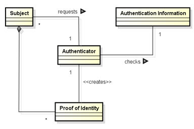

# Authenticator pattern tutorial

## What is the _Authenticator_ pattern?

This security pattern is used to implement an authentication mechanism. A class diagram of the pattern is given below.

This pattern allows _Subject_ to be authenticated using a set of objects known as _Authentication Information_. These objects are used by an _Authenticator_ to generate a security token known as _Proof of Identity_. The authentication mechanism is the generation of _Proof of Identity_ by an _Authenticator_ from a _Subject_ _Authentication Information_ and its assignment in a specific field of the subject class.

## How to use the pattern?

### Subject entity

- Identify the _Subject_ class. It is the class whose instance you need to authenticate. This class should be annotated with `@ModelEntity` (to let the PAMELA Framework that it is part of your model) and `@AuthenticationSubject(patternID = <patternID>)` (to declare this model entity as a subject for the authentication pattern). The `<patternid>` is a String that identify you pattern. You could, for instance, have the following code:
~~~java

@ModelEntity
@AuthenticatorSubject("Authenticator pattern 1")
public class MySubject {
    ...
}
~~~
- Identify the getter(s) of the _Authentication Information_ of the subject class. The _Authentication information_ are the objects provided by _Subjects_ to be authenticated. These method should be annotated with `@AuthenticationInformation(patternID = <patternID>, paramID = <paramID>)`. Make sure to use the same `<patternID>` for all the annotations related to the same pattern.. The `<paramID>` is a string identifying a getter. You could, for instance, have the following code:
~~~java
@ModelEntity
@AuthenticatorSubject(patternID = "Authenticator pattern 1")
public class MySubject {
    
    @AuthenticationInformation(patternID = "Authenticator pattern 1", paramID = "username")
    public String getUsername(){
        ...
    }

    @AuthenticationInformation(patternID = "Authenticator pattern 1", paramID = "password")
    public int getPasswordHash(){
        ...
    }
}
~~~
- Identify the _Proof of Identity_ getter and setter of the _Subject_. The _Proof of Identity_ is the security token that will be given the _Subjects_ by the _Authenticator_, once the authentication is done. You should annotate theses methods respectively with `@ProofOfIdentityGetter(patternID = <patternID>)` and `@ProofOfIdentitySetter(patternID = <patternID>)`. You could, for instance, have the following code:
~~~java
@ModelEntity
@AuthenticatorSubject(patternID = "Authenticator pattern 1")
public class MySubject {
    
    @AuthenticationInformation(patternID = "Authenticator pattern 1", paramID = "username")
    public String getUsername(){
        ...
    }

    @AuthenticationInformation(patternID = "Authenticator pattern 1", paramID = "password")
    public int getPasswordHash(){
        ...
    }

    @ProofOfIdentityGetter(patternID = "Authenticator pattern 1")
    public SecurityToken getSecurityToken(){
        ...
    }

    @ProofOfIdentitySetter(patternID = "Authenticator pattern 1")
    public void setSecurityToken(SecurityToken token){
        ...
    }
}
~~~
- Identify the getter of the _Authenticator_ class and annotated it with `@AuthenticatorGetter(patternID = <patternID>)`. Your could, for instance have the following code.
~~~java
@ModelEntity
@AuthenticatorSubject(patternID = "Authenticator pattern 1")
public class MySubject {
    
    @AuthenticationInformation(patternID = "Authenticator pattern 1", paramID = "username")
    public String getUsername(){
        ...
    }

    @AuthenticationInformation(patternID = "Authenticator pattern 1", paramID = "password")
    public int getPasswordHash(){
        ...
    }

    @ProofOfIdentityGetter(patternID = "Authenticator pattern 1")
    public SecurityToken getSecurityToken(){
        ...
    }

    @ProofOfIdentitySetter(patternID = "Authenticator pattern 1")
    public void setSecurityToken(SecurityToken token){
        ...
    }

    @AuthenticatorGetter(patternID = "Authenticator pattern 1")
    public MyAuthenticator getAuthenticator(){
        ...
    }
}
~~~
- Finally, you just need to add an abstract method (or empty method if the class is not abstract) with the annotation `@AuthenticateMethod(patternID = <patternID>)`. Note that this method can have a body if you want. This method is the one which will be trigger the authentication at each call. You could for instance have the following code:
~~~java
@ModelEntity
@AuthenticatorSubject(patternID = "Authenticator pattern 1")
public class MySubject {
    
    @AuthenticationInformation(patternID = "Authenticator pattern 1", paramID = "username")
    public String getUsername(){
        ...
    }

    @AuthenticationInformation(patternID = "Authenticator pattern 1", paramID = "password")
    public int getPasswordHash(){
        ...
    }

    @ProofOfIdentityGetter(patternID = "Authenticator pattern 1")
    public SecurityToken getSecurityToken(){
        ...
    }

    @ProofOfIdentitySetter(patternID = "Authenticator pattern 1")
    public void setSecurityToken(SecurityToken token){
        ...
    }

    @AuthenticatorGetter(patternID = "Authenticator pattern 1")
    public MyAuthenticator getAuthenticator(){
        ...
    }

    @AuthenticateMethod(patternID = "Authenticator pattern 1")
    public void authenticate(){
        System.out.println("Authentication succeed, the proof of identity is now " + getSecurityToken());
    }
}
~~~   

### Authenticator entity

- Identify the _Authenticator_ class. It is the class whose instance will authenticate _Subjects_. This class should be annotated with `@ModelEntity` and `@Authenticator(patternID = <patternID>)`. Once again, the `<patternID>` should be the same as the one used to annotated the`_Subject_ class. You could, for instance, have the following code:
~~~java
@ModelEntity
@Authenticator("Authenticator pattern 1")
public class MyAuthenticator {
    ...
}
~~~
- Identify the _request_ method. This method is the one which is called when a subject try to authenticate. Its role is to check the _Authentication Information_ (given as parameter of the method) and return a _Proof of Identity_. it should be annotated with `@RequestMethod(patternID = <patternID>)`. The parameter of this method should also be annotated with the annotation of the associated _Authentication Information_ getters. You could, for instance, have the following code:
~~~java
@ModelEntity
@Authenticator(patternID = "Authenticator pattern 1")
public class MyAuthenticator {
    
    @RequestMethod(patternID = "Authenticator pattern 1")
    public SecurityToken createToken(@AuthenticationInformation(patternID = "Authenticator pattern 1", paramID = "username") String username, @AuthenticationInformation(patternID = "Authenticator pattern 1", paramID = "password") int password){
        ...
    }
}
~~~

## How does it work?

Once the _Subject_ and _Authenticator_ classes are correctly annotated, the PAMELA framework will ensure:
- That every call to the _authenticate_ method of any subject will update its _proof of identity_ with the result of its authenticator _request_ method.
- That the _Proof of identity_ of every subject is always valid (that is the result of the _request_ method of its authenticator). This prevents the _Subjects_ from forging a _Proof of Identity_.
- That the _Authentication information_ and _Authenticator_ fields of the _Subject_ class are final. Once they are assigned, their value should never change. This prevents the _Subjects_ from forging their _Authentication Information_ or their _Authenticator_.
- That different _Subjects_ have different _Authentication Information_. In the example above, different couples (login, hash). 

Extra: You can annotate has many _Subject_ methods as you want with `@RequiresAuthentication(patternID = <patternID>`. This annotation will ensure that every call to the method will first trigger the authentication process (call to the _Subject authenticate_ method).

